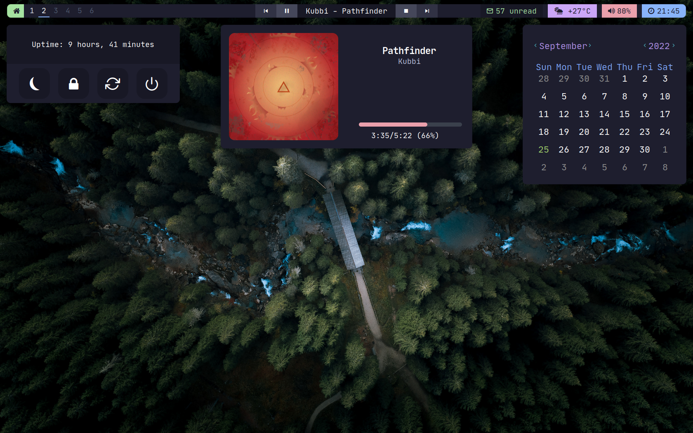
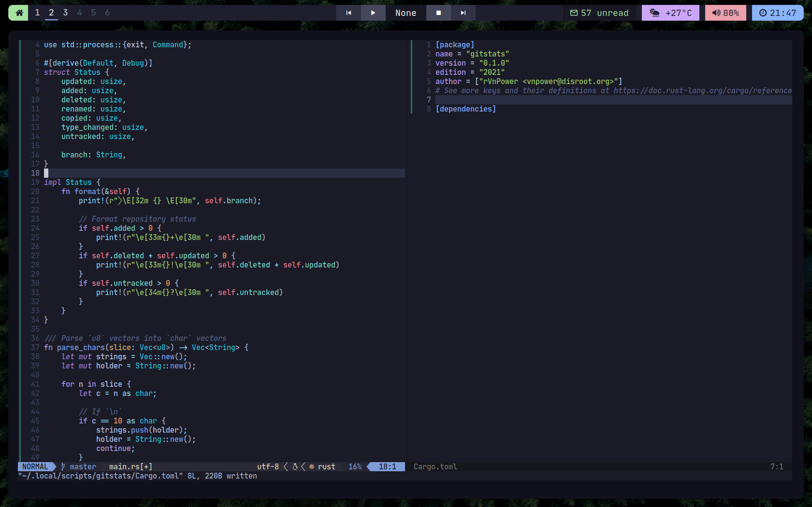

# dotfiles

## Software & programs
- Window Manager (WM): `bspwm`
- Shell: `mksh` with custom prompt
- Terminal: `st`
- Compositor: `picom`
- Panel & Widgets: `eww` 
- Browser: `ungoogled-chromium`
- Editor: `neovim`
- Application Launcher: `rofi`
- Notification Manager: `dunst`
- File Manager: `lf`

## Preview

